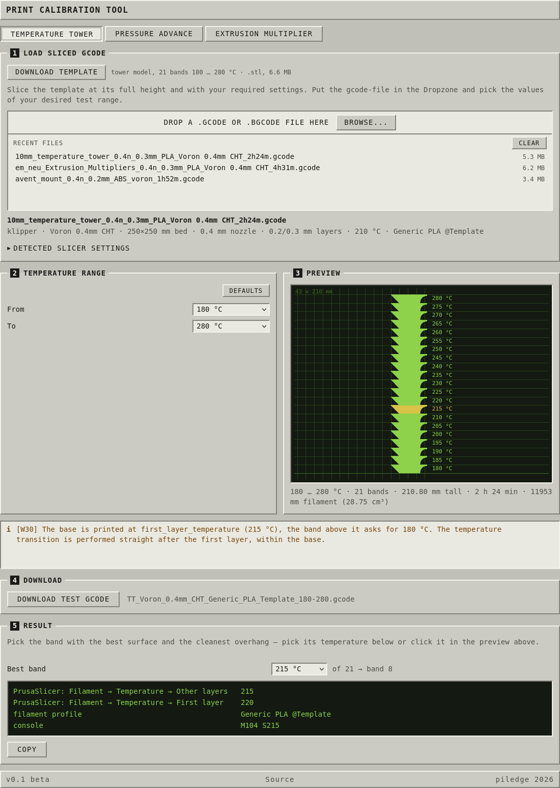
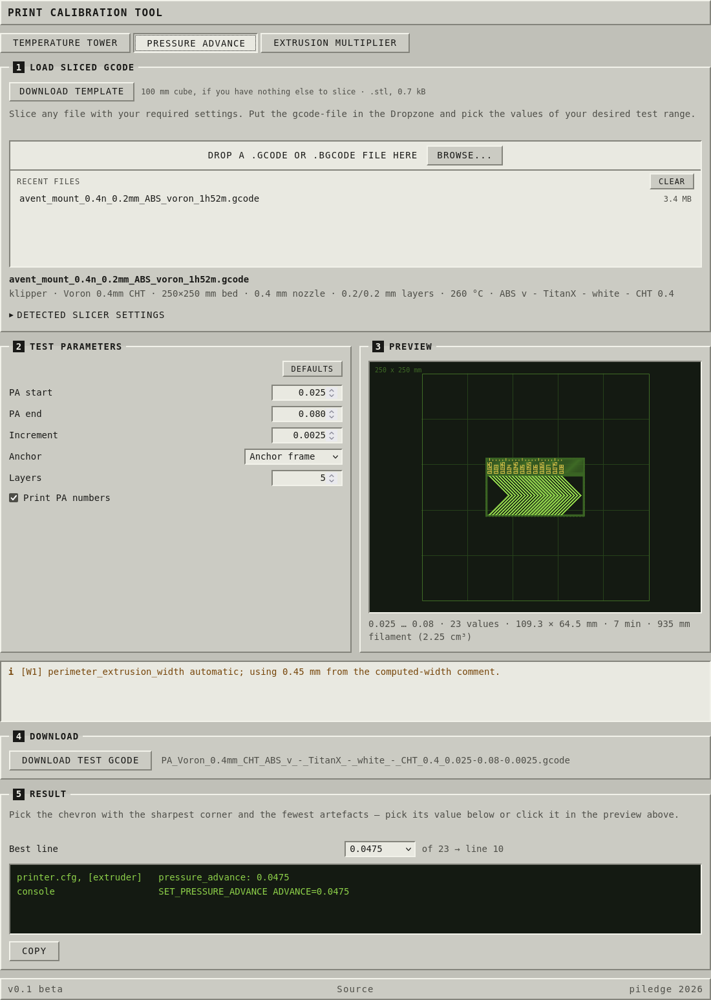
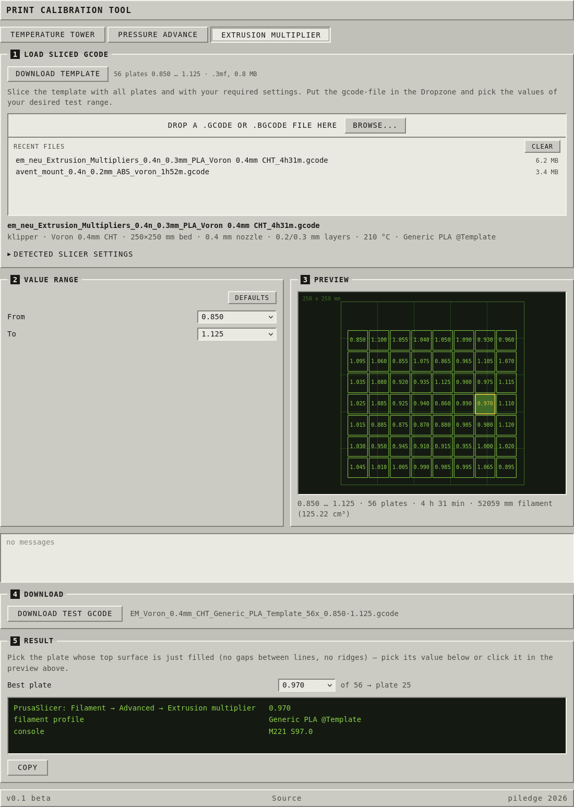

# Print Calibration Tool

Temperature tower, pressure advance and extrusion multiplier calibration, in the
browser, starting from a file you sliced.

**[Open the tool](https://piledge.github.io/Print-Calibration-Tool/)**


Other calibration generators build a print from scratch and ask you to type in
your machine. This one reads a sliced `.gcode` or `.bgcode` and keeps everything
that is already in it: your start G-code, your temperatures, retraction, cooling,
flow, your `PRINT_START` macro with all its arguments. The test print therefore
behaves like your normal prints, because most of it *is* your normal print.

## How you use it

1. Simply slice the template models available.
2. Drop the file on the page.
3. Pick the range you want to test.
4. Download, print.
5. Click the best specimen. You get the value and the line to put it in.

## Temperature tower



Slice the Template at full height: 21 bands of 10 mm, 180 °C
to 280 °C in steps of 5, the value embossed on each band. The tool sets the
hotend temperature per band and trims the tower to the range you pick.

Trimming stands the remaining bands on the model's own base, so three bands are a
30 mm print instead of a 210 mm one and still start on a proper first layer. The
temperature change is issued right after the first layer, while the rest of the
base is still printing, so nothing waits mid-print.

## Pressure advance



Slice anything at all. The model is thrown away; only the settings are kept. The
tool splices a chevron pattern between the slicer's start and end block, each
chevron printed at a different PA value, and you pick the sharpest corner.

The pattern is similar to the one from [Andrew Ellis' tuning
guide](https://ellis3dp.com/Print-Tuning-Guide/), redrawn.

## Extrusion multiplier



Slice the template complete: 56 tiles, 0.850 to 1.125 in
steps of 0.005. The tool rewrites the extrusion of every tile so each one prints
at its own multiplier, reading the target value from the object name. No geometry
is regenerated — the toolpaths stay byte for byte what your slicer produced.

Pick a range and the tiles outside it are dropped from the file, so a five-tile
run really only prints five tiles.

Requires **Output options → Label objects = Firmware-specific** in the print
settings.

## Running it yourself

Any static web server will do. HTTP is required — ES modules and WebAssembly do
not load over `file://`.

```sh
./serve.sh          # http://localhost:8080
```

That is `python3 -m http.server` in a wrapper. No build, no dependencies, no
`npm install`.

## What it supports

Tested on every change against two machines:

| | Voron 2.4 | Prusa CORE One |
|---|---|---|
| Firmware | Klipper | Marlin2 |
| PA command | `SET_PRESSURE_ADVANCE ADVANCE=` | `M572 S` |
| Object markers | `EXCLUDE_OBJECT_START/END` | `M486 S<id>` |
| E counting | absolute | relative |
| Input | `.gcode` | `.bgcode` |

Probably also recognised but not tested: Marlin 1.x (`M900 K`), RepRapFirmware (`M572 D S`), and the
Prusa XL/XL2/XL5/MK4/MINI (`M900 K`).

Not supported: slicers other than PrusaSlicer, round beds, beds whose origin is
not 0×0, and more than one extruder beyond detecting the tool index.

## Licence

- **Tool:** AGPL-3.0
- **Models:** [CC BY-NC 4.0](https://creativecommons.org/licenses/by-nc/4.0/)
- **`vendor/bgcode.js` / `vendor/bgcode.wasm`:** AGPL-3.0 — based on Prusa's [libbgcode](https://github.com/prusa3d/libbgcode)
- **Chevron pattern:** GPLv3 — derived from Sineos' Marlin K-factor tool and Ellis' guide
